# Design: PDE/particle hybrids as process-bigraph composites

This document explains, step by step and from first principles, how each hybrid approach in this repository
works and how it maps onto process-bigraph **Processes**, **Steps**, **stores** and **wires**.

It is meant to teach. It defines terms before using them and works through one small example model end to end.
Each mechanism is tied to the file that implements it. For the research plan and results, see [PLAN.md](PLAN.md).
For a line-by-line trace of the reference solver, see [fvsolver-hybrid-notes.md](fvsolver-hybrid-notes.md).

Figures are generated by [`figures/make_design_figures.py`](figures/make_design_figures.py)
(`pixi run python docs/figures/make_design_figures.py`). Code excerpts and printed outputs come from the code in this
repository, not from a separate sketch.

**Contents**

1. [Vocabulary](#1-vocabulary)
2. [The running example](#2-the-running-example)
3. [Partitioning one model into two halves](#3-partitioning-one-model-into-two-halves)
4. [Approach 0: the embedded hybrid in vcell-fvsolver](#4-approach-0-the-embedded-hybrid-in-vcell-fvsolver)
5. [A process-bigraph primer for this problem](#5-a-process-bigraph-primer-for-this-problem)
6. [Approach 1: two processes on a Cartesian grid](#6-approach-1-two-processes-on-a-cartesian-grid)
7. [The handoff: grids, binning and units](#7-the-handoff-grids-binning-and-units)
8. [Approach 2: one coordinator process with a chosen splitting](#8-approach-2-one-coordinator-process-with-a-chosen-splitting)
9. [Approach 3: swapping the PDE engine (FEniCSx Q1)](#9-approach-3-swapping-the-pde-engine-fenicsx-q1)
10. [Approach 4: an unstructured mesh behind a background grid](#10-approach-4-an-unstructured-mesh-behind-a-background-grid)
11. [Approach 5: particles loaded from positions, membrane from the mesh](#11-approach-5-particles-loaded-from-positions-membrane-from-the-mesh)
12. [The native VCell reference as a pipeline](#12-the-native-vcell-reference-as-a-pipeline)
13. [Steps and the component architecture (Phase 7)](#13-steps-and-the-component-architecture-phase-7)
14. [Summary table](#14-summary-table)
15. [File map](#15-file-map)

---

## 1. Vocabulary

| Term | Meaning here |
|---|---|
| **Field (continuous species)** | A concentration in µM, stored as an array of values at grid nodes or mesh DOFs, evolved by a PDE. |
| **Particle species** | Individual molecules with positions, moved by Brownian dynamics in Smoldyn. |
| **Mixed reaction** | A reaction that involves both a particle species and a field, e.g. `A_p → B_f` or `B_f → A_p`. |
| **Node** | A point of the Cartesian grid where field values live (node-centred grid, [§7](#7-the-handoff-grids-binning-and-units)). |
| **Element** | The control volume around a node. Boundary elements are halved per axis. |
| **DOF** | Degree of freedom of a finite element space. For P1 elements it is a mesh vertex. |
| **dt** | The PDE time step. |
| **k, τ** | The step multiplier: one particle step spans **τ = k·dt**, which is also the coupling interval. |
| **Binning / histogram** | Counting particles per node or element so the PDE can read them as concentrations. |
| **Operator splitting** | Advancing the PDE and the particles separately, each holding the other fixed, in some order. |
| **Process** | A process-bigraph unit that advances in time over an **interval** ([§5](#5-a-process-bigraph-primer-for-this-problem)). |
| **Step** | A process-bigraph unit without time, triggered when its inputs change. |
| **Store** | A named location in the composite's state tree that processes read and write through **wires**. |
| **Port / wire** | A process declares typed ports (`inputs()`, `outputs()`). The composite document wires each port to a store path. |

## 2. The running example

One model is used throughout: the **two-way exchange** from
[`composites/examples.py`](../viva_pde_particle/composites/examples.py), `two_way_exchange_model()`.

```
A (particles, D = 1 µm²/s)  --k1 = 1 /s-->           B (field, D = 1 µm²/s, B₀ = 0.2 µM)
B (field)                    --k2 = 0.5 /s · [B]-->  A (particles)
```

- **Domain:** a 10 × 10 µm square slab, 1 µm thick, with 11 × 11 × 3 nodes.
- **Initial state:** A starts empty. B is uniform.
- **Conservation:** A + B is conserved, and at steady state total A / total B = k2/k1.

This model has both kinds of mixed reaction:
- **Particle → field:** an A molecule disappears and B gains concentration.
- **Field → particle:** A molecules are created at a rate set by the local [B] (0th-order, field-dependent creation).

## 3. Partitioning one model into two halves

VCell does not run the whole model on both sides. Its Java math generation (`ParticleMathMapping.combineHybrid()`)
**partitions** one model into a PDE half and a particle half. [`model/hybrid_model.py`](../viva_pde_particle/model/hybrid_model.py)
`partition()` ports that logic:

- **PDE side:** every continuous species keeps every reaction term that changes it. A particle species appearing
  in a rate is read as its *binned* concentration.
- **Particle side:** every reaction that creates or destroys particles becomes a Smoldyn reaction over the particle
  species only.
  - Continuous reactants are **folded into the rate** (`k·[B]`).
  - Continuous products are **dropped**, because the PDE side adds them.

Running `partition(two_way_exchange_model())` gives the following (abbreviated):

```jsonc
// PDE half: one species, two terms
{"species": {"B": {"diffusion": 1.0}}, "particle_species": ["A"],
 "terms": [{"species": "B", "coeff": +1, "k": 1.0, "reactants": {"A": 1}, "reaction": "a_to_b"},
           {"species": "B", "coeff": -1, "k": 0.5, "reactants": {"B": 1}, "reaction": "b_to_a"}]}
// i.e. dB/dt = D∇²B + 1.0·[A]_binned − 0.5·[B]

// particle half: two Smoldyn reactions
{"species": {"A": {"diffusion": 1.0}}, "field_species": ["B"],
 "reactions": [{"name": "a_to_b", "reactants": ["A"], "products": [], "order": 1, "rate_constant": 1.0, "fields": []},
               {"name": "b_to_a", "reactants": [], "products": ["A"], "order": 0,
                "rate_constant": 301.107038, "fields": ["B"]}]}
```

**The key point:** neither side sends the other a flux. Each applies its own half of every mixed reaction and reads
the other side's state as it was at the last exchange.
- When an A molecule converts, Smoldyn deletes it, and the PDE adds `k1·[A]` from the *binned* A field.
- When B creates A, the PDE removes `k2·[B]`, and Smoldyn creates A at rate `k2·[B]` read *from the field it was
  last given*.

Mass balance therefore holds only up to the coupling (lag) error, which the studies measure.

**Units.** The rate constant 301.107 is `0.5 × 602.214`: a µM/s creation rate converted to molecules/(µm³·s)
([`units.py`](../viva_pde_particle/units.py), `smoldyn_rate_factor`). The factor is 1 for 1st order and 1/602.214
for 2nd order.

The particle half becomes a Smoldyn configuration file
([`model/smoldyn_config.py`](../viva_pde_particle/model/smoldyn_config.py)). For the example, with dt = 0.01 and k = 2,
the generated file is:

```text
dim 3
boundaries 0 0.0 10.0 r
boundaries 1 0.0 10.0 r
boundaries 2 0.0 1.0 r
species A
difc A 1.0
time_step 0.02                 # τ = k·dt
random_seed 7
start_surface walls ... end_surface              # reflecting box
start_compartment domain ... end_compartment
reaction a_to_b A -> 0 1.0
reaction_cmpt domain b_to_a 0 -> A 301.107038*B;  # field-dependent rate
```

The `…*B;` rate syntax is VCell's convention. In our Smoldyn fork (`virtualcell/Smoldyn`, branch `pyhybrid`), a
`GridValueProvider` evaluates it by looking up B at the grid node nearest the molecule. For 0th-order creation it
uses each grid element instead.

## 4. Approach 0: the embedded hybrid in vcell-fvsolver

This is the **reference**: the hard-coded hybrid loop inside vcell-fvsolver. It is not a process-bigraph composite,
but each later approach reproduces or varies one of its parts, so it comes first.

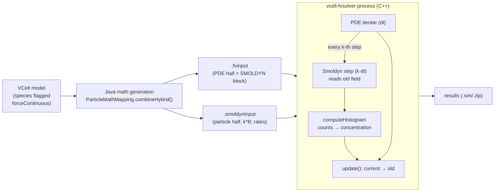

What happens in each PDE step (`SimTool.cpp`):
1. The PDE takes one step: diffusion implicit, reactions explicit.
2. Every k-th step, Smoldyn takes one step of length k·dt. Its rate expressions read the field's **old** array,
   which holds the value at `T + (k−1)·dt`.
3. Particles are binned to the nearest node and turned into concentrations.
4. All variables are copied from current to old.

Both sides read only **old** values, so the coupling is **lagged (Jacobi-style) operator splitting**:
- The PDE sees particle concentrations from the last Smoldyn step, held fixed for k PDE steps.
- Smoldyn sees the field from before the current PDE step.

The top row of Figure 1 shows the timing.

**What is fixed in this design:**
- There is one splitting order.
- The PDE discretization is the Cartesian FV mesh. Geometry is general: analytic, image or CSG, with membranes
  treated by tangent-plane and Voronoi numerics.
- Smoldyn 2.38 is embedded.
- Python has no access to anything between steps; `pyvcell_fvsolver.solve()` runs to completion.

The co-simulation keeps the *method* and makes each of those choices replaceable.

## 5. A process-bigraph primer for this problem

process-bigraph describes a simulation as a **document**: a nested dict that is both the **state** and the
**wiring**. Some entries are data (stores). Others are process or step instances, given by `_type`, `address`,
`config`, `interval` and wires.

### 5.1 Process

A `Process` (`process_bigraph.composite.Process`) is a unit of computation that **advances in time**:

```python
class MyProcess(Process):
    config_schema = {...}                      # typed configuration
    def initialize(self, config): ...          # build solvers, load files (once)
    def inputs(self):  return {"port": "type"} # what it reads
    def outputs(self): return {"port": "type"} # what it writes
    def update(self, state, interval):         # advance by `interval`, return a delta
        return {"port": new_value}
```

The composite calls `update(state, interval)` with:
- `state`: the values on the input ports at the **start** of the interval;
- `interval`: the process's own time step.

The returned dict is an **update**. It is applied to the stores when the process's interval ends. How it is applied
depends on the port's type:
- `float` *adds* the value;
- `overwrite[...]` *replaces* the stored value.

All our ports are `overwrite[...]`: a field or histogram is a full new value, not a delta.

### 5.2 Step

A `Step` has **no interval**. The composite runs it whenever one of its input stores changes (its "triggers"), in
dependency order, after process updates are applied. Steps are for instantaneous transformations: unit
conversions, derived quantities, observers. See [§13](#13-steps-and-the-component-architecture-phase-7) for how they
could fit here.

### 5.3 The scheduling rule that makes operator splitting work

The composite keeps a "front": the time at which each process's next update is due.
1. It advances global time to the earliest due time.
2. It applies the updates that are due.
3. It hands each newly started process the **current** state.

Two processes that run concurrently therefore both read the state from the **start** of their own intervals, and
neither sees the other's update until its own interval ends. This is the same "everyone reads old" rule that
vcell-fvsolver implements with its old/current arrays. [`tests/test_scheduling_semantics.py`](../tests/test_scheduling_semantics.py)
pins it down with toy processes that record every value they read. That test is why a two-process composite can
reproduce the fvsolver scheme exactly.

> **A pitfall we hit:** process-bigraph accumulates each process's time as a float sum of its intervals. An update
> that ends exactly at a recording time can land slightly *after* it (25 × 0.01 > 0.25 in floating point) and be
> deferred. [`composites/hybrid.py`](../viva_pde_particle/composites/hybrid.py) `run_document` therefore advances to
> half a step past each record time. The state is piecewise constant between updates, so the recorded value is
> exact.

### 5.4 The core

Processes are found by address (`local:FVReactionDiffusion`) in a **core** registry.
[`core.py`](../viva_pde_particle/core.py) `build_core()` registers this package's classes explicitly, because
auto-discovery misses editable installs. Always build composites against `build_core()`.

## 6. Approach 1: two processes on a Cartesian grid

The most direct translation of Approach 0 has **one PDE process and one particle process**, plus one **Step** that
converts the particle histogram into concentrations for the PDE (Phase 7a). They are wired through four stores.

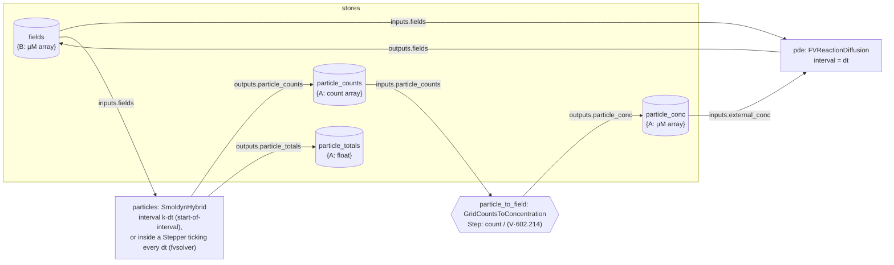

This is the actual document from `build_hybrid_document(two_way_exchange_model(), dt=0.01, step_multiplier=2)`
(arrays and long strings abbreviated):

```jsonc
{
  "fields":          {"B": "<array (3, 11, 11)>"},
  "particle_counts": {"A": "<array (3, 11, 11)>"},
  "particle_conc":   {"A": "<array (3, 11, 11)>"},
  "particle_totals": {"A": 0.0},
  "pde": {
    "_type": "process", "address": "local:FVReactionDiffusion", "interval": 0.01,
    "config":  {"grid": {"origin": [0,0,0], "size": [10,10,1], "num": [11,11,3]},
                "pde": { /* the PDE half from §3 */ }, "dt": 0.01},
    "inputs":  {"fields": ["fields"], "external_conc": ["particle_conc"]},
    "outputs": {"fields": ["fields"]}
  },
  "particle_to_field": {
    "_type": "step", "address": "local:GridCountsToConcentration",
    "config":  {"grid": {...}, "species": ["A"]},
    "inputs":  {"particle_counts": ["particle_counts"]},
    "outputs": {"particle_conc": ["particle_conc"]}
  },
  "particles": {
    "_type": "process", "address": "local:Stepper", "interval": 0.01,
    "config":  {"dt": 0.01, "every": 2, "phase": 1,           // coupling="fvsolver" (§6.3)
                "process": {"address": "local:SmoldynHybrid",
                            "config": {"grid": {...}, "config_text": "<637 chars>", "particle_species": ["A"],
                                       "field_species": ["B"], "dt": 0.01, "step_multiplier": 2}}},
    "inputs":  {"fields": ["fields"]},
    "outputs": {"particle_counts": ["particle_counts"], "particle_totals": ["particle_totals"]}
  }
}
```

### 6.1 The PDE process: `FVReactionDiffusion`

[`processes/fv_reaction_diffusion.py`](../viva_pde_particle/processes/fv_reaction_diffusion.py) reproduces
vcell-fvsolver's `FV_SOLVER`.
- **`initialize`:** builds the zero-flux Laplacian `K` on the grid and factorizes `S + D·dt·K` once per species,
  where `S` is the diagonal of element volume fractions.
- **`update(state, interval)`:**
  1. Reads `external_conc`: concentrations (µM) of species it uses but does not evolve, here A. The engine knows
     nothing about particles. The `GridCountsToConcentration` Step computes them as `count / (V_element · 602.214)`.
  2. Takes `round(interval/dt)` steps of

     `s_i·uᵢⁿ⁺¹ + D·dt·Σⱼ K_ij·uⱼⁿ⁺¹ = s_i·(uᵢⁿ + Rᵢⁿ·dt)`

     That is backward Euler for diffusion and forward Euler for reactions, with the particle concentrations held
     fixed.
  3. Returns `{"fields": ...}`.

### 6.2 The particle process: `SmoldynHybrid`

[`processes/smoldyn_hybrid.py`](../viva_pde_particle/processes/smoldyn_hybrid.py) owns a persistent
`smoldyn.Simulation` built from the generated configuration, plus a `smoldyn.HybridGrid` with the same node layout
as the PDE grid.

`update(state, interval)`:
1. Copies each input field into the HybridGrid with `setField` (no text I/O).
2. Advances Smoldyn by the interval, in whole steps of k·dt.
3. Returns `getMoleculeHistogram(species, grid)`, the nearest-node counts computed in C.

The engine keeps no clock of the PDE (Phase 7c). When it runs, and which field time it therefore reads, is decided by
how the composite schedules it (§6.3).

### 6.3 Two coupling modes, one exact match

Figure 1 shows which field value the Smoldyn step reads.

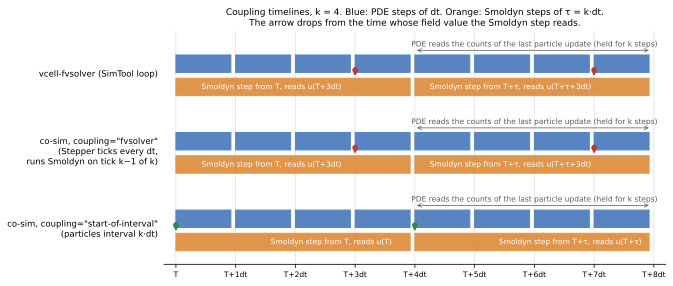

*Figure 1.*
- **vcell-fvsolver:** the Smoldyn step over `[T, T+τ]` runs after the k-th PDE iterate, but reads the *old* field,
  `u(T+(k−1)dt)`.
- **`coupling="fvsolver"`:** the co-sim reproduces this with a generic **`Stepper`** Process
  ([`processes/stepper.py`](../viva_pde_particle/processes/stepper.py)) that wraps the unchanged particle engine.
  - The Stepper ticks every dt and calls its child only on tick k−1 of every k, with interval k·dt.
  - The child therefore reads `u(T+(k−1)dt)`, exactly the value fvsolver reads, and its counts are first seen by the
    PDE step that starts at T+k·dt.
  - Plain process-bigraph scheduling cannot express this, because a process reads at the start of its interval and
    publishes at the end.
  - The Stepper knows nothing about Smoldyn: `every` and `phase` work for any child.
- **`coupling="start-of-interval"`:** the natural process-bigraph form. The particle interval is k·dt, and the
  step reads `u(T)`.
- **Both modes:** the PDE reads the counts of the last particle update for k steps.

`interval_for(coupling, dt, k)` returns the particle node's interval (dt for the Stepper, k·dt otherwise), and
`composites.hybrid.particle_node` builds the node for either mode.

**Mapping to Approach 0:**

| vcell-fvsolver | co-simulation |
|---|---|
| `simulation->iterate()` | `FVReactionDiffusion.update` (interval dt) |
| `smoldynOneStep` every k-th iterate | `SmoldynHybrid.update`, scheduled by a `Stepper` (every k, phase k−1) |
| `computeHistogram` + `copyParticleCountsToConcentration` | `getMoleculeHistogram` (C) + the `GridCountsToConcentration` Step |
| `VCellValueProvider::getValue` (nearest voxel) | `GridValueProvider` in the Smoldyn fork (nearest node) |
| old/current arrays | process-bigraph's "read state at interval start" |
| `.fvinput` + `.smoldynInput` from Java | `partition()` + `write_smoldyn_config()` from Python |

**Outcome (Investigation A).** The co-simulation matches native VCell within sampling noise. It shows the same
first-order error in τ, and costs 0.25–0.93× native wall time (see PLAN.md, Phase 3).

## 7. The handoff: grids, binning and units

Everything crosses between the halves through one shared grid, so its conventions must match exactly
([`grid.py`](../viva_pde_particle/grid.py), following VCell's `CartesianMesh`):

- **Nodes:** N nodes per axis, spacing **dx = L/(N−1)**, node i at `x0 + i·dx`. Field values live at nodes.
- **Elements:** the element of a node is the box of half-spacings around it, clipped to the domain. Faces have ½
  volume, edges ¼, corners ⅛.
- **Binning:** a particle belongs to the nearest node, `i = (int)((x−x0)/dx + 0.5)`.
- **Concentration:** `count / (V_element · 602.214)` in µM.
- **Array layout:** `(Nz, Ny, Nx)` in C order, which is VCell's x-fastest global index.

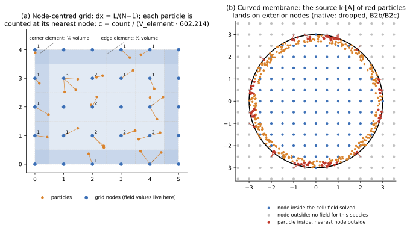

*Figure 2.*
- **(a)** Nearest-node binning on a node-centred grid. The numbers are counts per node. Boundary elements are
  shaded darker because they are smaller.
- **(b)** The same rule next to a curved membrane. A particle just inside the cell can be nearest to a node
  outside it (red). In native VCell those counts land on nodes where the field is not solved, so their PDE source
  is lost. The co-sim folds them back with `Pᵀ` ([§10](#10-approach-4-an-unstructured-mesh-behind-a-background-grid)).

Studies B2b and B2c measured these effects:
- **B2b:** native exchange in a ball loses 6.8% of A + B.
- **B2c:** native's outer shell runs 2.3% low and the co-sim's 1.3% high.
- **Code:** vcell-fvsolver's `computeHistogram` contains a same-compartment correction that is commented out.

## 8. Approach 2: one coordinator process with a chosen splitting

Approach 1 gets its ordering from the scheduler: both processes read old values. To use a *different* order (e.g.
Gauss–Seidel or Strang), something must sequence the substeps inside one coupling interval.
[`processes/splitting.py`](../viva_pde_particle/processes/splitting.py) `SplittingCoordinator` (Phase 7d; it replaced
the earlier `HybridCoupler`, which hard-coded FV + Smoldyn) does this for **any** engine pair:
- it holds a PDE engine, a particle engine and the adapter Steps as nodes (address, config, port → store wiring), just
  as in a composite document;
- over each interval τ it runs the engines in the order the `scheme` gives, on an internal copy of the stores;
- after each run it runs the adapters whose inputs changed.

`to_splitting_document(doc, scheme, dt, k)` turns any two-process document (FV, Q1 or mesh) into a coordinator
document.

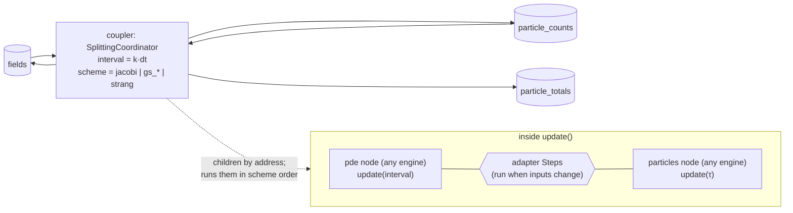

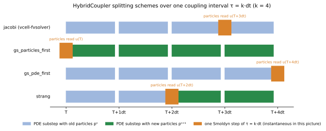

*Figure 3.* Order of substeps within one interval τ for each scheme (k = 4). In Jacobi, the coordinator holds the
particle update back until the end of the interval.
- **jacobi** is Approach 1 / vcell-fvsolver.
- **gs_particles_first** steps the particles first, so the PDE sees the new particles throughout.
- **gs_pde_first** steps the PDE first, so the particles see the end-of-interval field.
- **strang** puts the particle step at the midpoint. In theory that makes the splitting second order in τ, against
  first order for the other three.

**Why a coordinator Process?** The substeps are ordered *within* one interval, and each consumes the previous one's
output immediately. Process-bigraph's scheduler gives the Jacobi order for free (everyone reads old values), but not
the others. The coordinator adds only the ordering:
- it uses the children's public `update` methods, so the engines and adapters are reused unchanged and can be any
  registered components;
- the trade-off is that inside the coordinator the children are not separately visible in the composite's state tree.

**Outcome (Study B3, splitting-schemes).**
- Jacobi and both Gauss–Seidel orders are first order in τ.
- Strang keeps the error at the sampling floor up to τ = 0.16 s, 25× below Jacobi there. The particle side can
  therefore step about 32× less often at fvsolver-level accuracy.
- vcell-fvsolver's loop implements one fixed order (`SimTool.cpp`), so trying another there means changing the
  solver. Here it is a coordinator option, and since Phase 7d it works with any engine pair (e.g. Strang on the
  unstructured-mesh engine, `tests/test_splitting.py`).

## 9. Approach 3: swapping the PDE engine (FEniCSx Q1)

[`processes/fenicsx_reaction_diffusion.py`](../viva_pde_particle/processes/fenicsx_reaction_diffusion.py)
`FenicsxReactionDiffusion` has **the same ports** as `FVReactionDiffusion`: fields as grid-shaped arrays, plus
particle counts. That makes it a drop-in replacement. The composite changes in exactly one place,
`"address": "local:FenicsxReactionDiffusion"` (`build_hybrid_document(..., pde_engine="fenicsx")`).

Inside, it solves with Q1 finite elements on a hexahedral mesh whose vertices *are* the grid nodes:
`(M + D·dt·K) uⁿ⁺¹ = M (uⁿ + dt·Rⁿ)`.
- **Mass:** the lumped Q1 mass at a vertex equals the FV element volume exactly, so counts convert to µM identically.
- **Stiffness:** `K` is the 27-point Q1 stencil rather than FV's 7-point stencil, a different second-order
  discretization.

**Lesson (Study B1, fenicsx-same-problem):** the swap changes results only by the PDE discretization error. The
coupling does not notice. This is what "a process is an interface" buys.

## 10. Approach 4: an unstructured mesh behind a background grid

A body-fitted tetrahedral mesh of a curved domain no longer has nodes that coincide with the grid Smoldyn bins on.
[`processes/fenicsx_mesh_reaction_diffusion.py`](../viva_pde_particle/processes/fenicsx_mesh_reaction_diffusion.py)
`FenicsxMeshReactionDiffusion` solves on the mesh alone. Since Phase 7, two Steps translate between its DOFs and that
grid, so the field has **two representations**.

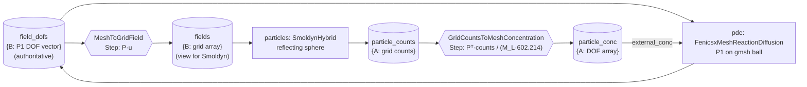

The pieces:
- the mesh process treats the DOF vector as authoritative and publishes only `field_dofs`. It knows neither the grid
  nor the particles;
- the `MeshToGridField` Step samples the DOFs onto the grid as `fields`, for Smoldyn's rate lookups;
- a particle → mesh Step (`GridCountsToMeshConcentration`) fills the engine's `external_conc`.

Both Steps use one sparse matrix **P** (grid nodes × mesh DOFs), built once in
[`mesh.py`](../viva_pde_particle/mesh.py) `MeshGridTransfer` and shared through a per-process cache:
- **Mesh → grid:** `u_grid = P·u`. Row n of P holds the barycentric weights of grid node n in its tetrahedron, so
  P·u is the P1 interpolant. A node outside the mesh copies its nearest DOF.
- **Grid → mesh:** `load = Pᵀ·counts`, i.e. `load_j = Σ_n φ_j(x_n)·count_n`. Because P's rows sum to 1, molecules
  are conserved exactly. The Step hands the PDE `[A]_j = load_j / (ml_j · 602.214)`, where `ml_j = ∫φ_j` is the
  lumped mass of DOF j.

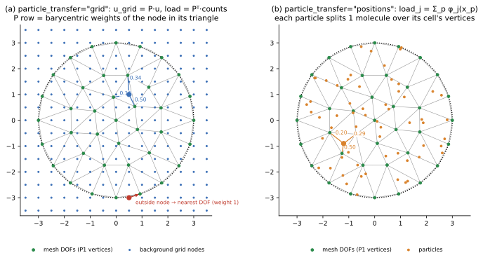

*Figure 4.*
- **(a)** The grid route. A grid node inside a triangle gets barycentric weights (blue). A node outside the mesh maps
  to its nearest DOF with weight 1 (red).
- **(b)** The positions route of [§11](#11-approach-5-particles-loaded-from-positions-membrane-from-the-mesh). Each
  particle splits one molecule over the vertices of its own cell.

The particle process is unchanged: it still sees a grid. In this approach Smoldyn is confined by a reflecting sphere
(`panel sph`), the exact membrane. Since B2d, the default is the mesh's own boundary instead (§11).

**Outcome (Studies B2, B2b, B2c).**
- The ball runs conservatively, and the co-sim agrees with native VCell on conversion.
- **Artifact (with the sphere membrane):** the outer shell runs 1.3% high (B2c, z = 10).
  - B2c first blamed the two-stage transfer: exterior grid nodes send their whole count to one boundary DOF.
  - B2d showed the cause is the **domain mismatch** instead. The exact sphere holds about 1.4% more volume than the
    inscribed polyhedral mesh, and particles in that sliver load the boundary DOFs.
  - Giving Smoldyn the mesh boundary as its membrane removes the bias even with the grid route (§11).

## 11. Approach 5: particles loaded from positions, membrane from the mesh

Approach 5 removes the grid from the particle → mesh direction and makes the particle domain equal the PDE domain.
Two options of `build_mesh_hybrid_document` control it:

| option | values | effect |
|---|---|---|
| `particle_transfer` | `"grid"` (Approach 4) / `"positions"` | the PDE loads particles from `Pᵀ·counts`, or directly from molecule positions |
| `membrane` | `"sphere"` / `"mesh"` | Smoldyn is confined by the exact sphere, or by the PDE mesh's own boundary triangles |

**The wiring adds one store:**
- `SmoldynHybrid` (with `emit_positions: true`) writes `particle_positions` ({species: (n, 3) array}).
- The `PositionsToMeshConcentration` Step reads it and writes `particle_conc` for the mesh process.

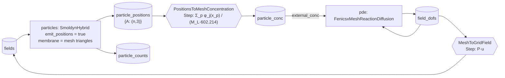

**Exact P1 load.** For each particle p in cell c with barycentric weights λ, add λ_i to the load of vertex i:
`load_j = Σ_p φ_j(x_p)`. If particles are uniform with density ρ, then `E[load_j] = ρ ∫φ_j = ρ·ml_j`. So
`E[[A]_j]` is uniform right up to the boundary, with no boundary bias by construction.
`tests/test_boundary_transfer.py` checks this.

**Locating particles.** Each particle's cell must be found every coupling step.
- **On a grid,** this is arithmetic (`round((x − x0)/dx)`).
- **On an unstructured mesh,** no formula exists. dolfinx's general search, a bounding-box tree (its "collision"
  queries), took ~0.6 s for 20k particles.
- **`PointLocator`** in `mesh.py` instead builds a **voxel → tet lookup table** once:
  1. Lay a uniform voxel grid over the mesh (voxel ≈ ⅓ of the mean tet edge).
  2. List each tet in every voxel its bounding box overlaps.
- The list is a conservative superset: a tet that contains a point always overlaps that point's voxel.
- **A query** is one arithmetic voxel lookup, followed by barycentric tests of that voxel's few candidates, nearest
  centroid first.
- **Result:** 4.9 ms for 20k particles, against 631 ms for the tree search, with identical inside/outside results.

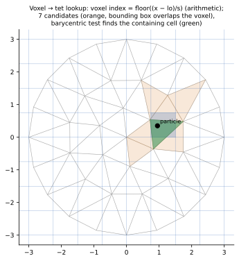

*Figure 5.* The 2D analogue of the lookup:
- the particle's voxel (blue) is found by arithmetic;
- the cells whose bounding boxes overlap it are the only candidates (orange);
- a barycentric test picks the containing cell (green).

**Mesh membrane.** `boundary_triangles(mesh)` extracts the exterior facets, oriented outward, and
`write_smoldyn_config(geometry={"kind": "triangles", ...})` emits them as `panel tri` surfaces (806 panels for the
B2b ball). Particles then never leave the PDE domain. The ~1.4% sliver between sphere and mesh is gone, and so is
the boundary load it caused.

**This is what VCell already does.** VCell's Smoldyn input also confines particles by `panel tri` surfaces taken from
its own geometry. For the B2b ball, it writes 9,516 triangles with vertex radius 3.972 ± 0.016 µm, enclosing 261.8 µm³.
The co-sim adopts the same principle with one difference:
- **Co-sim:** the triangles *are* the PDE mesh boundary, so the particle domain and the PDE domain are identical.
- **Native VCell:** the PDE runs on the voxel staircase (266.7 µm³), and the membrane is a smoothed surface triangulation
  of the same geometry. The two agree to within a voxel, so the particle compartment is 1.8% smaller than the PDE's
  `cell`.

That residual mismatch helps explain the native results in B2b:
- **Creation:** 0.982 (compartment/PDE volume) × 0.976 (centre-only creation rule) = 0.958, matching the measured 0.960.
- **Binning:** particles just inside the smooth membrane can be nearest to an exterior voxel node (exterior binning).

**Keeping a triangulated membrane cheap: avoid N×M work.** With N molecules and M membrane triangles, two Smoldyn
operations can degrade to N×M work:

| Operation | Smoldyn's acceleration | What the co-sim does |
|---|---|---|
| Collision checks during diffusion (`checksurfaces`) | Virtual boxes, each listing the panels it intersects | Always writes `boxsize` (default two grid spacings) |
| Compartment test (`posincompart`: creation thinning, random placement) | VCell's `highResVolumeSamples` voxel map: inside or outside from the 3×3×3 sample neighbourhood, exact test only next to the surface | Writes the map from `mesh.volume_samples` (`volume_samples=2` per grid spacing by default) |

- **Boxes:** without `boxsize`, Smoldyn sizes boxes from the *initial* molecule count. A model that starts with no
  particles (the exchange case) got a single box, so every molecule tested all 806 triangles every step.
- **The map:** VCell's Java writer already emits it. Upstream Smoldyn kept the code, but parsed the keyword only in
  VCell's own build; our fork now accepts it under `OPTION_VCELL`.

Measured on the B2b ball, exchange, wall s per simulated s:

| configuration | wall s per sim s |
|---|---|
| single box, no map | 4.55 |
| + `boxsize` | 0.45 |
| + volume-sample map | 0.25 |
| sphere membrane (reference) | 0.21 |

Results are identical seed for seed with and without the map.

**Outcome (Study B2d, cosim-boundary-transfer).** The four combinations on the B2c problem, 32 seeds each:

| transfer / membrane | outer-shell bias (z) | exchange mass balance | wall s per sim s |
|---|---|---|---|
| grid / sphere | +1.27% (10.3) | +2.9% | 0.71 |
| positions / sphere | +1.24% (10.0) | +2.9% | 2.98 |
| **grid / mesh (default)** | **+0.12% (1.2)** | **+0.69%** | 1.07 |
| positions / mesh | +0.07% (0.7) | +1.0% | 3.56 |

**What the table shows:**
- **The membrane matters, not the transfer.** The bias came from the domain mismatch: particles in the sphere-mesh
  sliver are projected onto boundary DOFs. With matching domains the grid route is as good as the exact load, at
  about a third of its cost. The default is therefore `membrane="mesh"` with grid transfer.
- **A second bug surfaced along the way, in field-dependent creation inside a curved compartment.** Our Smoldyn
  fork, like VCell's vendored Smoldyn, drew molecules only in grid cells whose *centre* lies inside the compartment.
  Creation fell 2.4% short in this ball, which is B2b's "creation deficit". Every cell now draws, and the existing
  inside-test thinning makes the count exact.
- **Two errors had been cancelling.** Before the fix, the sphere variants' small exchange error (−1.2%) was the
  creation deficit offset by the sphere's extra 1.4% of volume.

## 12. The native VCell reference as a pipeline

The native solver is used as a *reference*, not as a component. It is a function, not a process
([`reference/vcell_native.py`](../viva_pde_particle/reference/vcell_native.py)):

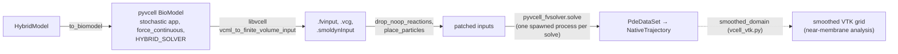

- **One process per solve.** vcell-fvsolver segfaults on a second hybrid solve in the same process, so
  `run_native` spawns a child process for each solve.
- **No stepping.** It runs to completion, so it could be wrapped as a process-bigraph Process only as a "whole run"
  process, with no step-level exchange.
- **Post-processing.** The patches between generation and solve (`drop_noop_reactions`, `place_particles`) and the
  smoothed-grid analysis (`vcell_vtk.smoothed_domain`) are documented in their docstrings and in PLAN.md.

## 13. Steps and the component architecture (Phase 7)

**The goal (PLAN.md, Phase 7):** reusable process-bigraph components that assemble into an accurate hybrid
co-simulation:
- **Core engines,** a PDE solver and a particle solver, that are general and know nothing about each other;
- **Adapters (Steps)** that do all the coupling work: unit conversion, binning and transfer between
  discretizations;
- **Orchestration and geometry** as separate, reusable pieces.

Before Phase 7 every unit was a Process, and the coupling was buried inside the engines. The studies showed why
that matters. Every accuracy problem we found was an adapter or geometry problem, not an engine problem:
- exterior-node binning (vcell-fvsolver#25);
- the membrane–voxel volume mismatch (B2c);
- the sphere–mesh domain mismatch (B2d);
- curved-compartment creation (vcell-fvsolver#26).

**Target decomposition:**

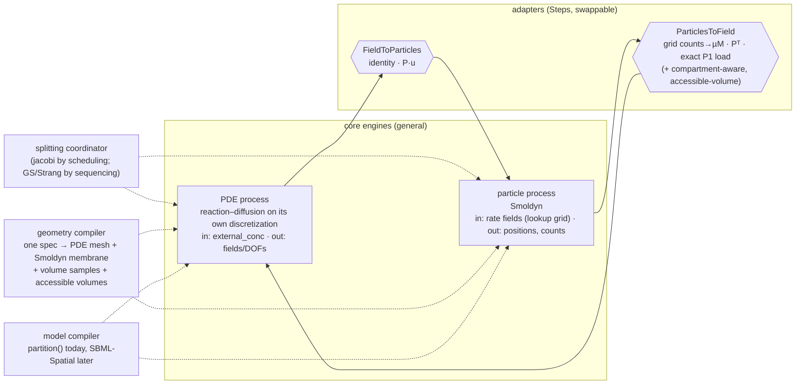

**Why Steps are the right construct for adapters.** A Step runs when its inputs change, after the process updates of
that time point are applied and before the next process intervals start. An adapter triggered by the particle output
therefore computes exactly what the PDE would have computed from the raw output at the start of its interval. The
coupling timing of §6.3 is unchanged.

**Status:**

| Sub-phase | Component | Status |
|---|---|---|
| 7a | `ParticlesToField` Steps: `GridCountsToConcentration` (FV, Q1), `GridCountsToMeshConcentration` (Pᵀ), `PositionsToMeshConcentration` (P1 load). The PDE engines take a generic `external_conc` and no longer know about particles. | **done**: bit-identical to the pre-refactor code on six composites (`scripts/component_regression.py`). The mesh composites run 1.8–3.5× faster, because the PDE no longer receives the grid histogram or positions through its ports. |
| 7b | `FieldToParticles` Step (`MeshToGridField`, P·u). The mesh engine publishes only DOFs and needs no grid; it builds from the mesh alone through a shared `mesh_space` cache. | **done**: bit-identical on the same six composites; same speed as 7a. |
| 7c | The particle engine without the PDE clock: `SmoldynHybrid` reads at the start of each update and advances by its interval. fvsolver timing comes from a generic `Stepper` Process (tick dt; child on tick k−1 of every k, with interval k·dt). | **done**: bit-identical on the six composites, including fvsolver mode with k = 2. |
| 7d | `SplittingCoordinator`: any PDE engine, particle engine and adapters, by address, in Jacobi, Gauss–Seidel or Strang order. It replaces `HybridCoupler`. | **done**: bit-identical on all four schemes and the earlier composites (20 arrays); new capability is splitting with the mesh engine. |
| 7e | Geometry compilers. A vcell-fenics `GeometryDescription` is realized by a PDE compiler (FEniCS/Netgen, or VCell-FV via libvcell) into a `RealizedGeometry`. The Smoldyn membrane (always smooth), volume samples and the adapters' accessible volumes are derived from that realization (PLAN.md "Phase 7e plan"). | in progress: 7e.1 (dependencies), 7e.2 (`RealizedGeometry`, FEniCS/Netgen compiler, `geometry=` composites) and 7e.3 (Smoldyn geometry derived from the realization; non-convex domains) done |
| 7f | Packaging: a component contract (units, array layouts, timing), catalog registration, and mixed example composites. | planned |

**Costs to watch.**
- **Overhead:** each adapter adds a store, which process-bigraph types and copies when it changes. So far this has
  been a net gain (7a).
- **Configuration:** the composite builders, and later the geometry and model compilers, must configure every
  component consistently. That is the price of not hard-wiring them.

## 14. Summary table

| Approach | process-bigraph units | Coupling order | PDE discretization | Particle ↔ field transfer | Main finding (study) |
|---|---|---|---|---|---|
| 0. vcell-fvsolver | — (one C++ loop) | Jacobi (fixed) | FV, Cartesian + membrane numerics | nearest node | reference |
| 1. Two processes | `FVReactionDiffusion` + `SmoldynHybrid` (Processes) | Jacobi, by the scheduler | FV, Cartesian | nearest node (same grid) | matches native within noise; 0.25–0.93× cost (A) |
| 2. Coordinator | `SplittingCoordinator` (one Process sequencing any engines and adapters) | jacobi / GS / Strang | any (FV, Q1, P1 mesh) | via the adapter Steps | Strang 25× more accurate at τ = 0.16 s (B3) |
| 3. Engine swap | `FenicsxReactionDiffusion` + `SmoldynHybrid` | Jacobi | FEniCSx Q1 on the grid | nearest node | differs only by PDE discretization (B1) |
| 4. Unstructured mesh | `FenicsxMeshReactionDiffusion` + `SmoldynHybrid` | Jacobi | FEniCSx P1, body-fitted | grid histogram, then `Pᵀ` / `P` | conservative; boundary shell +1.3% (B2c) |
| 5. Mesh membrane (± positions) | same; optional `particle_positions` store | Jacobi | FEniCSx P1, body-fitted | grid `Pᵀ` (default) or exact P1 load | mesh membrane removes the bias (+0.12%, z 1.2); positions not needed (B2d) |

## 15. File map

| Concept | File |
|---|---|
| Grid conventions, binning, element volumes | `viva_pde_particle/grid.py` |
| Units | `viva_pde_particle/units.py` |
| Model and partition (combineHybrid port) | `viva_pde_particle/model/hybrid_model.py` |
| Smoldyn configuration writer | `viva_pde_particle/model/smoldyn_config.py` |
| FV PDE process | `viva_pde_particle/processes/fv_reaction_diffusion.py` |
| Smoldyn process | `viva_pde_particle/processes/smoldyn_hybrid.py` |
| Splitting coordinator | `viva_pde_particle/processes/splitting.py` |
| Coarse/phase-shifted scheduling of any process (Phase 7c) | `viva_pde_particle/processes/stepper.py` |
| Adapter Steps, both directions (Phase 7a, 7b) | `viva_pde_particle/steps/transfer.py` |
| Bit-exact refactor regression | `scripts/component_regression.py` |
| FEniCSx Q1 process | `viva_pde_particle/processes/fenicsx_reaction_diffusion.py` |
| FEniCSx P1 mesh process | `viva_pde_particle/processes/fenicsx_mesh_reaction_diffusion.py` |
| Mesh ↔ grid transfer, point location, mesh membrane | `viva_pde_particle/mesh.py` |
| Geometry descriptions, realizations, derived Smoldyn geometry (Phase 7e) | `viva_pde_particle/geometry/` |
| Composite documents and the run loop | `viva_pde_particle/composites/hybrid.py` |
| Registered composite generators (workbench) | `viva_pde_particle/composites/examples.py` |
| Native VCell reference | `viva_pde_particle/reference/vcell_native.py`, `reference/vcell_vtk.py` |
| Smoldyn hybrid extensions (C++) | `external/Smoldyn` (`source/vcell/HybridGrid.h`, `GridValueProvider.*`, `source/python/module.cpp`) |
| Scheduling semantics test | `tests/test_scheduling_semantics.py` |
